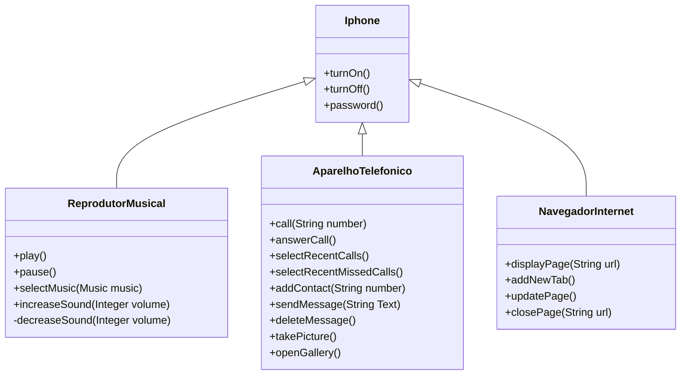

```mermaid
classDiagram
    Iphone <|-- ReprodutorMusical
    Iphone <|-- AparelhoTelefonico
    Iphone <|-- NavegadorInternet


    Iphone: +turnOn()
    Iphone: +turnOff()
    Iphone: +password()
    
 

    class ReprodutorMusical{
      +play()
      +pause()
      +selectMusic(Music music)
      +increaseSound(Integer volume)
      -decreaseSound(Integer volume)
    }
    class AparelhoTelefonico {
      +call(String number)
      +answerCall()
      +selectRecentCalls()
      +selectRecentMissedCalls()
      +addContact(String number)
      +sendMessage(String Text)
      +deleteMessage()
      +takePicture()
      +openGallery()
    } 
    class NavegadorInternet{
      +displayPage(String url) 
      +addNewTab()
      +updatePage()
      +closePage(String url)
    }

```
